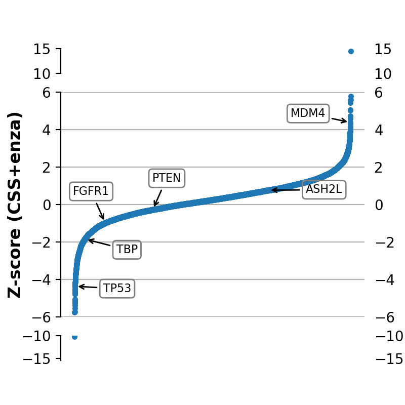

<!-- PROJECT LOGO -->
 

  

<h2 align="center">Q-ProstateNet</h2>

  

    <h4 align="center">Q-ProstateNet: A Biologically Informed Graph Neural Network for Personalized Treatment of Prostate Cancer</h4>
     
     
     
    <a href="https://htmlpreview.github.io/?https://github.com/femiogundare/prostate-cancer-genomics/blob/main/_plots/figure3/sankey_diagram.html" align="center">View interactive network architecture</a>
    ·
    ·
  

This repository is my implementation of the paper <b><a href="https://www.nature.com/articles/s41586-021-03922-4">Biologically Informed Deep Neural Network for Prostate Cancer Discovery</a></b> by Haitham Elmarakeby, Eliezer Van Allen, et al.

Haitham Elmarakeby is currently an Instructor at the Dana-Farber Cancer Institute in Boston, Massachusetts. Eliezer Van Allen is an associate member at the Broad Institute of MIT and Harvard and an Assistant Professor at the Dana-Farber Cancer Institute and Harvard Medical School. You can read about the Van Allen Lab <a href="https://vanallenlab.dana-farber.org/">here</a>.

<!-- TABLE OF CONTENTS -->

  
<h2 style="display: inline-block">Table of Contents</h2>

  <ol>
    <li>
      <a href="#about-the-project">About the Project</a>
    </li>
    <li><a href="#network-architecture">Neural Network Architecture</a></li>
    <li><a href="#train-test">Training and Testing</a></li>
    <li><a href="#results">Results</a></li>
    <li><a href="#findings">Findings</a></li>
    <li><a href="#supplementary">Supplementary Figures</a></li>
    <li><a href="#References">References</a></li>
  </ol>

<!-- about-the-project -->
## About the Project

When treating a cancer patient, oncologists aim to predict the course of the patient's disease to make critical treatment decisions. Knowing a tumor's unique molecular signature can help guide these decisions by providing clues on whether a cancer is slow-growing or aggressive and deadly, or one that will resist treatment. New molecular profiling technologies have generated a wealth of information on tumors, but physicians have struggled to turn all that data into meaningful prognoses.

Here, I developed a deep learning predictive model that can differentiate between the genomic profiles of prostate cancers that are lethal and those that are very much unlikely to cause symptoms or death. The model, called Q-ProstateNet, may help physicians know in advance whether a prostate cancer patient's tumor will spread to other parts of the body or become more resistant to treatment over time. Q-ProstateNet can also identify molecular features, genes, and biological pathways that may be linked to disease progression.

<!-- network-architecture -->
## Neural Network Architecture

A set of 3,007 curated biological pathways were used to build Q-ProstateNet. In Q-ProstateNet, the molecular profile of an individual is fed into the model and distributed over a layer of nodes representing a set of genes using weighted links.

<b>Fig. 1 | Neural Network Architecture</b>. Q-ProstateNet encodes various biological entities into a neural network with customized connections between consecutive layers (that is, features from patient profile, genes, pathways, biological processes and outcome).

 

Subsequent layers of the network encode a set of pathways with increasing levels of abstraction, whereby lower layers represent fine pathways and later layers represent more complex biological pathways and biological processes. The connections between different layers are constrained to follow known child–parent relationships among encoded features, genes and pathways, and as a result the network is geared toward interpretability by design.

<b>Fig. 2 | Inspection and interpretation of Q-ProstateNet</b>. Visualization of the inner layers of Q-ProstateNet shows the approximate relative importance of different nodes in each layer. Nodes on the far left denote feature types; the nodes in the second layer denote genes; the next layers denote higher-level biological entities; and the final layer denote the model outcome.

 

<!-- train-test -->
## Training and Testing

Q-ProstateNet was trained on data such as genomic sequences and somatic, or uninherited, mutations from more than 1,000 prostate cancer patients. On testing the model on data from other prostate cancer patients, it was found that it correctly distinguishes about 80% of metastatic tumors from primary, less advanced tumors.

<!-- results -->
## Results

The trained Q-ProstateNet outperformed traditional machine learning algorithms, including logistic regression, decision trees, and linear and radial basis support vector machines (area under the receiver operating characteristic (ROC) curve (AUC) = 0.93, area under the precision-recall curve (AUPRC) = 0.89, accuracy = 0.84).

Table | Diagnostic performance of Q-ProstateNet compared to traditional machine learning algorithms.

| Model | AUC | Precision | Recall | f1 | AUPRC | AUPRC |
| :-----: | :-----: | :-----: | :-----: | :-----: | :-----: | :-----: |
| Q-ProstateNet | 0.93 | 0.72 | 0.82 | 0.77 | 0.89 | 0.84 |
| Logistic Regression | 0.91 | 0.81 | 0.64 | 0.72 | 0.84 | 0.83 |
| Linear SVM | 0.91 | 0.80 | 0.61 | 0.69 | 0.85 | 0.82 |
| RBF SVM | 0.91 | 0.82 | 0.61 | 0.70 | 0.86 | 0.83 |
| Decision Tree | 0.83 | 0.88 | 0.63 | 0.73 | 0.73 | 0.85 |
| Random Forest | 0.88 | 0.75 | 0.57 | 0.64 | 0.78 | 0.79 |
| AdaBoost | 0.89 | 0.93 | 0.57 | 0.70 | 0.83 | 0.84 |

<b>Fig. 3 | Receiver operating curves of Q-ProstateNet and traditional machine learning alorithms</b>.

 
<b>Fig. 4 | Precision-recall curves of Q-ProstateNet and traditional machine learning alorithms</b>.

 
<b>Fig. 5 | Confusion matrix of Q-prostateNet</b>.

 
<b>Fig. 6 | Performance comparision of Q-ProstateNet (P-Net) and a dense fully connected network</b>. Q-ProstateNet achieves better performance (measured as the average AUC over five cross-validation splits) with smaller numbers of samples compared to a dense fully connected network with the same number of parameters. The solid line represents the mean AUC and the bands represent mean ± s.d. (n = 5 experiments).

 

<!-- findings -->
## Findings

Q-ProstateNet selected a hierarchy of pathways (out of 3,007 pathways on which it was trained) as relevant to classification, including post-translational modifications (SUMOylation and ubiquitination), transcriptional regulation by RUNX2 and TP53, and cell cycle checkpoints. Multiple entities of the cell cycle pathway have been reported to be involved in metastatic prostate cancer, and specifically investigated in treatment-resistant conditions. Ubiquitination and SUMOylation pathways contribute to the regulation of several tumor suppressors and oncogenes, and dysregulation of these pathways has been linked to prostate cancer initiation and progression. RUNX2 activates expression in bone matrix and adhesion proteins, and is overexpressed in metastatic disease in patients with prostate cancer; TP53 provides instructions for making a protein called tumor protein p53 which acts as a tumor suppressor.

It was found that among aggregate molecular alterations, copy number variation was more informative compared with mutations. This is in agreement with the findings of Hieronymus, et al. in their paper <b><a href="https://pubmed.ncbi.nlm.nih.gov/25024180/">Copy number alteration burden predicts prostate cancer relapse</a></b>.

Using the DeepLIFT attribution method to obtain the total importance score of genes, AR, TP53, PTEN and RB1, which are widely known drivers of prostate cancer, were highly ranked. Alterations in less known genes, such as MDM4, FGFR1 and MUC16, also strongly contributed to the predictive performance of Q-ProstateNet.

<b>Fig. 7 | Joint distribution of AR, TP53 and MDM4 alterations across 1,013 prostate cancer samples using an UpSetPlot</b>. A gene is said to be altered if it has a mutation, deep deletion or high amplification.

 

<b>Fig. 8 | Analysis of enzalutamide (enza)-resistant genes in LNCaP cells based on a genome-scale screen of about 17,300 open reading frames (ORFs). The relative enzalutamide resistance of each ORF (x-axis) is plotted as a Z-score (y-axis), with higher Z-scores representing more resistance. CSS denotes a low androgen medium.</b>. By examining Q-ProstateNet and weighting genes and pathways based on their importance, MDM4 was identified to be potentially involved in prostate cancer progression and drug resistance..

 

<b>Fig. 9 | Relative viability of C42, LNCAP, LNCAP 95 and LNCAP Abl after transduction of CRISPR/Cas9 and sgRNAs targeting of MDM4</b>. When MDM4 was turned off using gene editing (CRISPR-Cas9), data analysis showed that cell proliferation decreased, implying that the cancer cells could be more sensitive to treatment. This suggests two things:
* Popular prostate cancer medications like Xtandi® (enzalutamide) and Zytiga® (abiraterone acetate), which are antiandrogenic in action, may be less effective in the treatment of prostate cancer patients whose genomic profiles show an overexpression of MDM4;
* Big biopharmaceutical companies could remodel drugs that inhibit MDM4 to treat prostate tumors.

 

<!-- supplementary -->
## Supplementary Figures
<b>Fig. 10 | Graph of mutation against copy-number alteration</b>.

 

<b>Fig. 11 | Relative ranking of nodes in each layer of Q-ProstateNet</b>.

 

<b>Fig. 12 | Activation distribution of important nodes in each layer of Q-ProstateNet</b>.

 

<!-- References -->
## References
* Elmarakeby H, et al. "Biologically informed deep neural network for prostate cancer classification and discovery." Nature. Online September 22, 2021. DOI: 10.1038/s41586-021-03922-4
* Armenia, Joshua, et al. "The long tail of oncogenic drivers in prostate cancer." Nature genetics 50.5 (2018): 645-651.
* Robinson, Dan R., et al. "Integrative clinical genomics of metastatic cancer." Nature 548.7667 (2017): 297-303.
* Fraser, Michael, et al. "Genomic hallmarks of localized, non-indolent prostate cancer." Nature 541.7637 (2017): 359-364.
* Abida, W., et al. "Genomic correlates of clinical outcome in advanced prostate cancer." Proc. Natl Acad. Sci. USA 116, 11428–11436 (2019).
* Fabregat, A., et al. "The Reactome pathway knowledgebase." Nucleic Acids Res. 46, D649–D655 (2018).
* Hieronymus, H., et al. "Copy number alteration burden predicts prostate cancer relapse." Proc. Natl Acad. Sci. USA 111, 11139–11144 (2014).